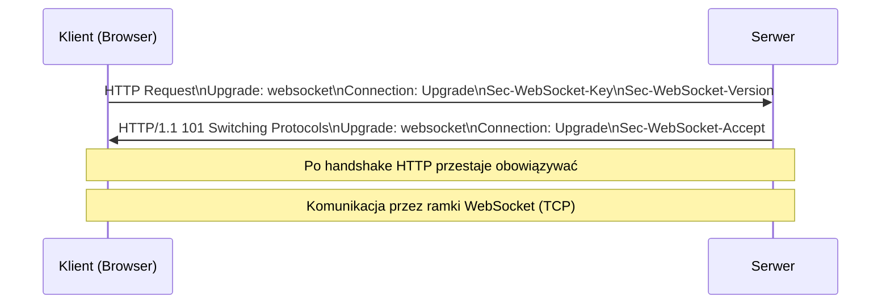

# Handshake – przejście z HTTP do WebSocket


## 1. Idea handshake’u

Handshake WebSocket to **proces przejścia z protokołu HTTP do protokołu WebSocket**. Jest to **jedyny moment**, w którym WebSocket korzysta z HTTP.

Celem handshake’u jest:

* wykorzystanie istniejącej infrastruktury HTTP (porty, proxy, firewalle),
* bezpieczne uzgodnienie, że obie strony obsługują WebSocket,
* ustanowienie stałego połączenia nad TCP.

---

## 2. Co się dzieje technicznie? 🔄

### Krok 1: Klient wysyła request HTTP

Klient (najczęściej przeglądarka) rozpoczyna komunikację **zwykłym żądaniem HTTP**.

Kluczowe nagłówki:

```
Upgrade: websocket
Connection: Upgrade
Sec-WebSocket-Key: <losowy klucz base64>
Sec-WebSocket-Version: 13
```

Znaczenie:

* `Upgrade` – prośba o zmianę protokołu
* `Connection: Upgrade` – informacja, że zmiana dotyczy tego połączenia
* `Sec-WebSocket-Key` – losowa wartość używana do weryfikacji serwera
* `Sec-WebSocket-Version` – wersja protokołu (obecnie 13)

---

### Krok 2: Serwer odpowiada

Jeśli serwer obsługuje WebSocket i akceptuje połączenie, odpowiada:

```
HTTP/1.1 101 Switching Protocols
Upgrade: websocket
Connection: Upgrade
Sec-WebSocket-Accept: <wartość wyliczona>
```

Znaczenie:

* `101 Switching Protocols` – oficjalna zgoda na zmianę protokołu
* `Sec-WebSocket-Accept` – potwierdzenie poprawności handshake’u

---

## 3. Diagram handshake’u (Mermaid)



---

## 4. Co dzieje się po handshake’u? ➡️

Po poprawnym handshake’u:

* **HTTP przestaje obowiązywać**
* nie ma już:

  * request / response
  * nagłówków HTTP
* komunikacja odbywa się za pomocą:

  * ramek WebSocket (text / binary / control)
  * stałego połączenia TCP

---

## 5. Najważniejsze rzeczy do podkreślenia studentom 🎓

* handshake to **jedyny moment**, gdy WebSocket używa HTTP
* HTTP jest tylko „drzwiami wejściowymi”
* dalej to:

  * czyste TCP
  * full-duplex
  * niskie opóźnienia

> **WebSocket zaczyna się jako HTTP, ale nigdy nim nie pozostaje.**
