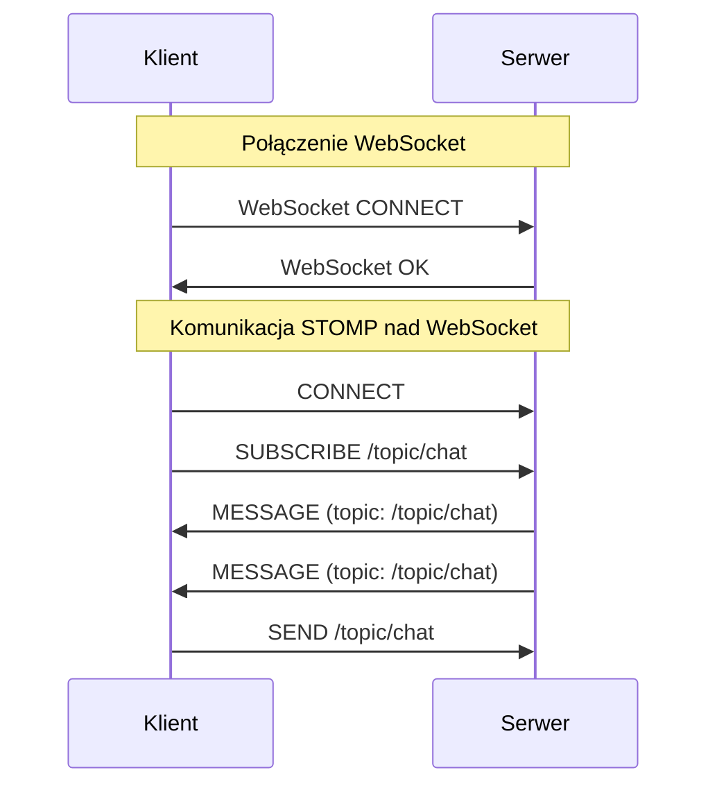

# Dlaczego sam WebSocket to za mało? (STOMP)

## 1. Punkt wyjścia

WebSocket zapewnia **szybki, dwukierunkowy kanał komunikacyjny**, ale sam w sobie jest bardzo **niskopoziomowy**. Daje „rurę do przesyłania danych”, lecz **nie narzuca żadnych zasad**, jak te dane mają być organizowane.

I właśnie tutaj pojawia się problem.

---

## 2. Problem „czystego” WebSocketa

Korzystając wyłącznie z WebSocketów, **wiele kluczowych mechanizmów trzeba zaimplementować samodzielnie**.

Brakuje wbudowanego:

* **routingu wiadomości** (dokąd dana wiadomość ma trafić?)
* **mechanizmu subskrypcji** (kto ma ją otrzymać?)
* **semantyki komunikatów** (co oznacza dana wiadomość?)

W praktyce oznacza to, że:

* każda aplikacja definiuje własny format JSON
* trzeba ręcznie obsługiwać:

  * typy zdarzeń
  * listy subskrybentów
  * mapowanie użytkowników na połączenia

➡️ **Dużo kodu, dużo decyzji i duże ryzyko chaosu.**

---

## 3. Naturalna potrzeba wyższego poziomu abstrakcji

W aplikacjach realtime często myślimy w kategoriach:

* „wyślij wiadomość do tematu”
* „zasubskrybuj kanał”
* „użytkownik X powinien dostać tę wiadomość”

Tego typu pojęcia **nie istnieją w czystym WebSockecie**.

---

## 4. Rozwiązanie: STOMP

### Czym jest STOMP?

**STOMP (Simple Text Oriented Messaging Protocol)** to **prosty protokół komunikatów**, który działa **na WebSockecie**.

* jest tekstowy (czytelny dla człowieka)
* wprowadza jasne komendy i strukturę
* przypomina znane systemy messagingowe

---

## 5. Co daje STOMP?

STOMP wprowadza **gotową semantykę komunikacji**.

### Podstawowe komendy

* **CONNECT / DISCONNECT** – zarządzanie sesją
* **SEND** – wysyłanie wiadomości
* **SUBSCRIBE / UNSUBSCRIBE** – subskrypcje

---

### Destinations (adresowanie)

STOMP wprowadza pojęcie **destination**, np.:

* `/topic/chat`
* `/queue/notifications`
* `/user/123/messages`

Dzięki temu:

* wiadomości są routowane automatycznie
* wielu klientów może subskrybować ten sam temat
* serwer nie musi ręcznie zarządzać listami odbiorców

---

## 6. WebSocket ≠ STOMP (to bardzo ważne!)

| WebSocket           | STOMP               |
| ------------------- | ------------------- |
| kanał komunikacyjny | protokół wiadomości |
| transport           | semantyka           |
| ramki               | komendy             |

* **WebSocket → transport**
* **STOMP → protokół wiadomości**

STOMP **nie zastępuje** WebSocketa — on go **wykorzystuje**.

---

## 7. Diagram: WebSocket vs WebSocket + STOMP (Mermaid)

---
