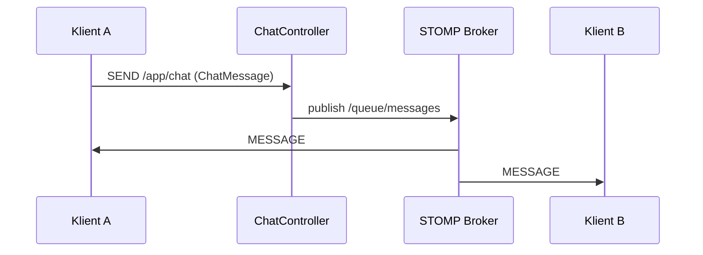

# ChatController – obsługa wiadomości STOMP w Spring

---

## 1. Rola kontrolera WebSocket

Klasa `ChatController` pełni podobną rolę do klasycznego kontrolera REST, ale:

* **nie obsługuje HTTP**
* **nie ma request / response**
* reaguje na **wiadomości STOMP** przesyłane przez WebSocket

Można o niej myśleć jak o:

> „kontrolerze zdarzeń realtime”.

---

## 2. Adnotacja `@Controller`

```java
@Controller
public class ChatController {
```

* oznacza klasę jako komponent Springa
* Spring wykrywa ją automatycznie
* pozwala obsługiwać komunikację WebSocket/STOMP

➡️ W przeciwieństwie do REST, **nie używamy tu `@RestController`**.

---

## 3. `@MessageMapping("/chat")`

```java
@MessageMapping("/chat")
```

### Co robi ta adnotacja?

* mapuje **destynację STOMP** na metodę Java
* działa analogicznie do `@PostMapping`, ale dla WebSocketów

### Jak to wygląda w praktyce?

Frontend wysyła:

```
SEND /app/chat
```

Spring:

* usuwa prefiks `/app`
* wywołuje metodę `receiveMessage(...)`

➡️ **`/app/chat` → `@MessageMapping("/chat")`**

---

## 4. `@SendTo("/queue/messages")`

```java
@SendTo("/queue/messages")
```

### Co robi `@SendTo`?

* określa, **gdzie zostanie wysłany wynik metody**
* publikuje wiadomość do brokera STOMP
* broker rozsyła ją do wszystkich subskrybentów

Frontend (subskrypcja):

```
SUBSCRIBE /queue/messages
```

➡️ Każdy klient subskrybujący `/queue/messages` dostanie wiadomość.

---

## 5. Sygnatura metody `receiveMessage`

```java
public ChatMessage receiveMessage(Principal principal, ChatMessage message)
```

### Parametry metody

#### `ChatMessage message`

* treść wiadomości wysłanej przez klienta
* Spring automatycznie:

  * deserializuje JSON
  * mapuje go na obiekt `ChatMessage`

#### `Principal principal`

* reprezentuje **uwierzytelnionego użytkownika**
* pochodzi z mechanizmu bezpieczeństwa Spring Security
* zawiera m.in.:

  * nazwę użytkownika (`principal.getName()`)

➡️ Dzięki temu nie trzeba przesyłać loginu w payloadzie.

---

## 6. Logika metody

```java
return new ChatMessage(
    principal.getName() + ": " + message.content()
);
```

Co się tu dzieje:

* serwer:

  * bierze nazwę zalogowanego użytkownika
  * dokleja ją do treści wiadomości
* tworzy **nowy obiekt wiadomości**
* zwraca go do brokera STOMP

➡️ Metoda **nie wysyła odpowiedzi bezpośrednio** – robi to broker.

---

## 7. Pełny przepływ wiadomości (end-to-end)



---

## 8. Najważniejsze rzeczy do zapamiętania 🎓

* `@MessageMapping` = wejście wiadomości do backendu
* `@SendTo` = broadcast przez brokera
* metoda nie zna klientów – **broker zajmuje się dystrybucją**
* WebSocket ≠ REST

> **W WebSocketach serwer reaguje na zdarzenia, a nie na zapytania.**

---

*(Dalej: wysyłanie wiadomości do konkretnego użytkownika – `/user`)*
