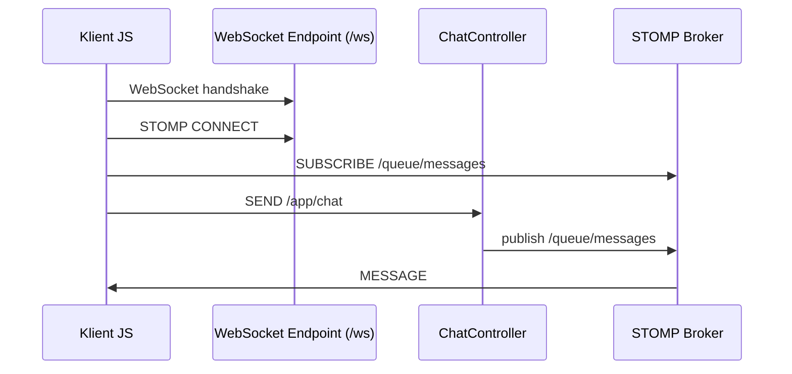

# Klient JavaScript – STOMP over WebSocket (omówienie)

---

## 1. Rola klienta JS w architekturze

Kod JavaScript:

* inicjuje połączenie WebSocket,
* komunikuje się z backendem za pomocą **komend STOMP**,
* subskrybuje wiadomości z serwera,
* wysyła wiadomości bezpośrednio do aplikacji backendowej.

Frontend **nie komunikuje się bezpośrednio z kontrolerem**, lecz:

> **wysyła i odbiera wiadomości przez broker STOMP**.

---

## 2. Tworzenie klienta STOMP

```javascript
const stompClient = new StompJs.Client({
    brokerURL: '/ws'
})
```

### Co tu się dzieje?

* `StompJs.Client` – klient STOMP w JavaScript
* `brokerURL: '/ws'`:

  * adres endpointu WebSocket
  * musi odpowiadać temu, co skonfigurowano w Springu (`/ws`)

➡️ To **punkt handshake’u WebSocket**.

---

## 3. Aktywacja połączenia

```javascript
stompClient.activate();
```

* inicjuje połączenie WebSocket
* wykonuje handshake HTTP → WebSocket
* następnie wysyła komendę STOMP `CONNECT`

Po tej linii:

* klient próbuje połączyć się z serwerem
* backend jest gotowy na komunikację realtime

---

## 4. Obsługa zdarzenia `onConnect`

```javascript
stompClient.onConnect = (frame) => {
    console.log('Connected: ' + frame);
    stompClient.subscribe('/queue/messages', (message) => {
        handleIncomingMessage(message);
    });
};
```

### Co oznacza `onConnect`?

* wywoływane po:

  * poprawnym handshake WebSocket
  * zaakceptowaniu połączenia STOMP przez serwer

---

### Subskrypcja `/queue/messages`

```javascript
stompClient.subscribe('/queue/messages', callback)
```

* klient zapisuje się na destynację STOMP
* broker będzie przesyłał tu wiadomości z backendu

➡️ Ta destynacja odpowiada `@SendTo("/queue/messages")` po stronie Springa.

---

## 5. Wysyłanie wiadomości do backendu

```javascript
function sendMessage() {
    stompClient.publish({
        destination: "/app/chat",
        body: JSON.stringify({'content': getMessage()})
    });
}
```

### Co robi `publish`?

* wysyła komendę STOMP `SEND`
* `destination: "/app/chat"`:

  * trafia do backendu
  * mapowane na `@MessageMapping("/chat")`

➡️ `/app/chat` **nie jest brokerem** – to wejście do aplikacji.

---

### Payload wiadomości

```json
{
  "content": "Hello world"
}
```

* przesyłany jako JSON
* Spring automatycznie mapuje go na obiekt `ChatMessage`

---

## 6. Odbiór wiadomości z serwera

```javascript
function handleIncomingMessage(message) {
    console.log(message.body)
    const messageArea = document.getElementById('messageArea');
    const newMessage = document.createElement('div');
    const jsonMessage = JSON.parse(message.body);
    newMessage.textContent = jsonMessage.content;
    messageArea.appendChild(newMessage);
}
```

### Co zawiera `message`?

* `message.body` – payload wiadomości (string)
* dane pochodzą **bezpośrednio z backendu**

➡️ To odpowiedź wysłana przez brokera STOMP, a nie REST API.

---

## 7. Rozłączanie klienta

```javascript
function disconnect() {
    stompClient.deactivate();
    console.log("Disconnected");
}
```

* wysyła komendę STOMP `DISCONNECT`
* zamyka połączenie WebSocket
* zwalnia zasoby po stronie serwera

---

## 8. Pełny przepływ wiadomości (frontend ↔ backend)



---

## 9. Najważniejsze rzeczy do zapamiętania 🎓

* `brokerURL` → endpoint WebSocket
* `activate()` → start połączenia
* `subscribe()` → odbiór wiadomości
* `publish()` → wysyłanie do backendu
* frontend **nie zna kontrolera** – zna tylko destynacje

> **Frontend wysyła zdarzenia. Backend publikuje wiadomości.**

---
